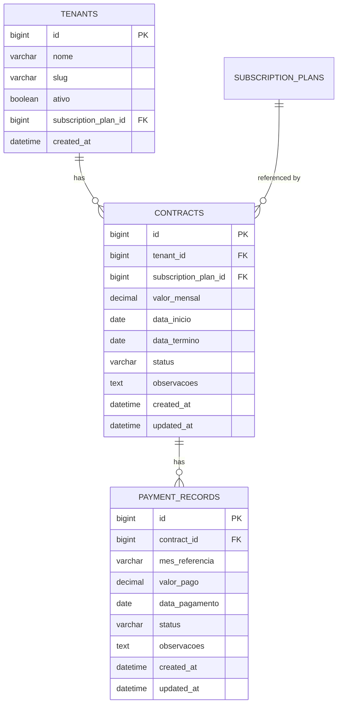

# Design Document — SaaS Contracts & Architecture Manual

## Overview

This design covers two complementary deliverables for the ERP Corporativo SaaS B2B multi-tenant platform (Java 21 / Spring Boot 3.5 / Thymeleaf / MySQL):

1. **Architecture Manual** (`docs/ARCHITECTURE.md`) — a living Markdown document that codifies all development standards: layer structure, naming conventions, Thymeleaf page patterns, new-module creation guide, security/multi-tenancy patterns, and REST API standards.

2. **Contracts & Subscriptions Module** — full CRUD for the SUPER_ADMIN panel at `/admin/contratos`, covering `Contract` and `PaymentRecord` entities, payment history, dashboard KPIs/alerts, and integration with the existing `Tenant` and `SubscriptionPlan` entities.

Both deliverables follow the exact patterns established by the `OrdemServico` reference implementation.

---

## Architecture

### Layer Dependency Graph

```
┌─────────────────────────────────────────────────────────────┐
│  controller/web  ──►  usecase  ──►  repository              │
│  controller/api  ──►  usecase  ──►  service (shared)        │
│                                ──►  repository              │
│  service (shared) ──►  repository                           │
│  model  (no outbound deps)                                  │
│  dto    (no outbound deps)                                  │
└─────────────────────────────────────────────────────────────┘
```

### Package Structure (new additions highlighted)

```
com.jaasielsilva.erpcorporativo.app
├── model/
│   ├── Contract.java                    ← NEW
│   ├── ContractStatus.java              ← NEW
│   ├── PaymentRecord.java               ← NEW
│   ├── PaymentStatus.java               ← NEW
│   └── AuditAction.java                 ← EXTENDED
├── repository/
│   └── contract/
│       ├── ContractRepository.java      ← NEW
│       ├── ContractSpecifications.java  ← NEW
│       └── PaymentRecordRepository.java ← NEW
├── usecase/web/admin/
│   ├── ContractUseCase.java             ← NEW
│   └── BuildAdminDashboardUseCase.java  ← EXTENDED
├── controller/web/admin/
│   └── AdminContractWebController.java  ← NEW
├── controller/api/v1/admin/
│   └── ContractAdminApiController.java  ← NEW
├── dto/web/admin/contract/
│   ├── ContractForm.java                ← NEW
│   ├── ContractViewModel.java           ← NEW
│   ├── ContractListViewModel.java       ← NEW
│   ├── PaymentRecordForm.java           ← NEW
│   └── PaymentRecordViewModel.java      ← NEW
├── dto/web/admin/
│   └── AdminDashboardViewModel.java     ← EXTENDED
└── config/
    └── SecurityConfig.java              ← EXTENDED (no-op: /admin/** already covered)
```

### Template Structure (new additions)

```
src/main/resources/templates/
└── admin/
    └── contratos/
        ├── index.html    ← listing with KPI cards + filter + table
        ├── form.html     ← shared create/edit form (isEdit flag)
        └── detail.html   ← contract detail + payment history
```

---

## Components and Interfaces

### 1. Architecture Manual

**File:** `docs/ARCHITECTURE.md`

The manual is a single Markdown file at the repository root's `docs/` folder. It is a living document — updated whenever a new pattern is established. Sections:

1. Project Overview & Tech Stack
2. Layer Structure & Dependency Rules
3. Naming Conventions
4. Multi-Tenancy & Security Patterns
5. Thymeleaf Page Patterns
6. New Module Creation Checklist
7. REST API Standards
8. Audit Logging Pattern
9. Testing Strategy

### 2. New Entities

#### `Contract`

```java
@Entity
@Table(name = "contracts")
// No @FilterDef/@Filter — Contract is a SUPER_ADMIN entity, not tenant-scoped
public class Contract {
    Long id;
    @ManyToOne Tenant tenant;                    // FK → tenants
    @ManyToOne SubscriptionPlan subscriptionPlan; // FK → subscription_plans
    BigDecimal valorMensal;                       // negotiated monthly value
    LocalDate dataInicio;
    LocalDate dataTermino;                        // nullable = open-ended
    @Enumerated(EnumType.STRING) ContractStatus status;
    String observacoes;                           // TEXT, nullable
    LocalDateTime createdAt;
    LocalDateTime updatedAt;
}
```

**Rationale for no tenant filter:** `Contract` is managed exclusively by SUPER_ADMIN and spans all tenants. Applying a tenant filter would break cross-tenant queries.

#### `ContractStatus` enum

```java
public enum ContractStatus {
    ATIVO,
    SUSPENSO,
    ENCERRADO,
    AGUARDANDO_ASSINATURA
}
```

#### `PaymentRecord`

```java
@Entity
@Table(name = "payment_records")
public class PaymentRecord {
    Long id;
    @ManyToOne Contract contract;   // FK → contracts
    YearMonth mesReferencia;        // stored as VARCHAR "YYYY-MM"
    BigDecimal valorPago;
    LocalDate dataPagamento;        // nullable if not yet paid
    @Enumerated(EnumType.STRING) PaymentStatus status;
    String observacoes;
    LocalDateTime createdAt;
    LocalDateTime updatedAt;
}
```

**Note on `YearMonth`:** JPA does not natively support `YearMonth`. Use an `AttributeConverter<YearMonth, String>` that serializes to `"YYYY-MM"` format, stored as `VARCHAR(7)`.

#### `PaymentStatus` enum

```java
public enum PaymentStatus {
    PAGO,
    PENDENTE,
    ATRASADO,
    CANCELADO
}
```

### 3. Repositories

#### `ContractRepository`

```java
public interface ContractRepository
        extends JpaRepository<Contract, Long>, JpaSpecificationExecutor<Contract> {

    boolean existsByTenantIdAndStatus(Long tenantId, ContractStatus status);
    long countByStatus(ContractStatus status);
    long countByStatusAndDataTerminoBefore(ContractStatus status, LocalDate date);

    @Query("select coalesce(sum(c.valorMensal), 0) from Contract c where c.status = :status")
    BigDecimal sumValorMensalByStatus(@Param("status") ContractStatus status);

    List<Contract> findByStatusAndDataTerminoBetween(
            ContractStatus status, LocalDate from, LocalDate to);

    Optional<Contract> findFirstByTenantIdAndStatus(Long tenantId, ContractStatus status);
}
```

#### `ContractSpecifications`

```java
public final class ContractSpecifications {
    public static Specification<Contract> byTenantNome(String nome) { ... }
    public static Specification<Contract> byStatus(ContractStatus status) { ... }
    public static Specification<Contract> byPlanoCodigo(String planoCodigo) { ... }
}
```

#### `PaymentRecordRepository`

```java
public interface PaymentRecordRepository extends JpaRepository<PaymentRecord, Long> {
    List<PaymentRecord> findByContractIdOrderByMesReferenciaDesc(Long contractId);
    Optional<PaymentRecord> findFirstByContractIdOrderByMesReferenciaDesc(Long contractId);
    long countByStatus(PaymentStatus status);
}
```

### 4. UseCase

#### `ContractUseCase`

```java
@Component
@RequiredArgsConstructor
public class ContractUseCase {

    // Dependencies
    private final ContractRepository contractRepository;
    private final PaymentRecordRepository paymentRecordRepository;
    private final TenantRepository tenantRepository;
    private final SubscriptionPlanRepository subscriptionPlanRepository;
    private final AuditService auditService;

    // Methods
    ContractListViewModel list(String tenantNome, ContractStatus status,
                               String planoCodigo, int page, int size);
    ContractViewModel getById(Long id);
    ContractViewModel create(ContractForm form, String executadoPor);
    ContractViewModel update(Long id, ContractForm form, String executadoPor);
    void updateStatus(Long id, ContractStatus novoStatus, String executadoPor);
    void delete(Long id, String executadoPor);

    // Payment record methods
    PaymentRecordViewModel addPayment(Long contractId, PaymentRecordForm form, String executadoPor);
    PaymentRecordViewModel updatePayment(Long contractId, Long paymentId,
                                         PaymentRecordForm form, String executadoPor);
}
```

**Business rules enforced in `create`:**
1. Validate that the tenant does not already have an `ATIVO` contract when creating a new `ATIVO` one.
2. After saving the contract, update `tenant.subscriptionPlan` to the selected plan.
3. Call `auditService.log(CONTRACT_CRIADO, ...)`.

**Business rules enforced in `updateStatus`:**
1. If new status is `ENCERRADO` or `SUSPENSO`, call `auditService.log(CONTRACT_ENCERRADO / CONTRACT_SUSPENSO, ...)`.

### 5. Controller

#### `AdminContractWebController`

```
GET  /admin/contratos              → index (list + KPIs)
GET  /admin/contratos/new          → form (isEdit=false)
POST /admin/contratos              → create
GET  /admin/contratos/{id}         → detail (+ payment history)
GET  /admin/contratos/{id}/edit    → form (isEdit=true)
POST /admin/contratos/{id}         → update
POST /admin/contratos/{id}/status  → updateStatus
POST /admin/contratos/{id}/delete  → delete
POST /admin/contratos/{id}/payments         → addPayment
POST /admin/contratos/{id}/payments/{pid}   → updatePayment
```

Pattern mirrors `OrdemServicoWebController` exactly: delegates to `ContractUseCase`, populates `pageTitle`, `pageSubtitle`, `activeMenu = "contratos"`, uses `RedirectAttributes` for toast feedback.

#### `ContractAdminApiController`

```
GET  /api/v1/admin/contratos           → list (JSON)
GET  /api/v1/admin/contratos/{id}      → detail (JSON)
POST /api/v1/admin/contratos           → create (JSON)
PUT  /api/v1/admin/contratos/{id}      → update (JSON)
DELETE /api/v1/admin/contratos/{id}    → delete (JSON)
```

### 6. DTOs

#### `ContractForm`

```java
@Data @NoArgsConstructor
public class ContractForm {
    @NotNull Long tenantId;
    @NotNull Long subscriptionPlanId;
    @NotNull @DecimalMin("0.00") BigDecimal valorMensal;
    @NotNull LocalDate dataInicio;
    LocalDate dataTermino;           // nullable
    @NotNull ContractStatus status;
    @Size(max = 2000) String observacoes;
}
```

#### `ContractViewModel` (record)

```java
public record ContractViewModel(
    Long id,
    Long tenantId, String tenantNome,
    Long subscriptionPlanId, String subscriptionPlanNome,
    BigDecimal valorMensal,
    LocalDate dataInicio, LocalDate dataTermino,
    ContractStatus status,
    String observacoes,
    boolean isVencido,              // dataTermino != null && dataTermino.isBefore(today) && status == ATIVO
    boolean isVencendoEm30Dias,     // dataTermino != null && dataTermino within 30 days && status == ATIVO
    PaymentStatus ultimoPagamentoStatus,  // nullable
    List<PaymentRecordViewModel> pagamentos,
    LocalDateTime createdAt, LocalDateTime updatedAt
) {}
```

#### `ContractListViewModel` (record)

```java
public record ContractListViewModel(
    List<ContractViewModel> items,
    int currentPage, int totalPages, long totalElements,
    // KPIs
    long totalAtivos,
    long totalVencidos,
    long totalAtrasados,
    BigDecimal mrrTotal
) {
    public boolean hasNext() { ... }
    public boolean hasPrev() { ... }
}
```

#### `PaymentRecordForm`

```java
@Data @NoArgsConstructor
public class PaymentRecordForm {
    @NotNull YearMonth mesReferencia;
    @NotNull @DecimalMin("0.00") BigDecimal valorPago;
    LocalDate dataPagamento;
    @NotNull PaymentStatus status;
    @Size(max = 1000) String observacoes;
}
```

#### `PaymentRecordViewModel` (record)

```java
public record PaymentRecordViewModel(
    Long id,
    YearMonth mesReferencia,
    BigDecimal valorPago,
    LocalDate dataPagamento,
    PaymentStatus status,
    boolean isAtrasado,   // status == ATRASADO
    String observacoes,
    LocalDateTime createdAt
) {}
```

### 7. `YearMonthConverter`

```java
@Converter(autoApply = true)
public class YearMonthConverter implements AttributeConverter<YearMonth, String> {
    public String convertToDatabaseColumn(YearMonth ym) {
        return ym == null ? null : ym.toString(); // "YYYY-MM"
    }
    public YearMonth convertToEntityAttribute(String s) {
        return s == null ? null : YearMonth.parse(s);
    }
}
```

### 8. `AuditAction` additions

```java
// Contracts
CONTRACT_CRIADO,
CONTRACT_ATUALIZADO,
CONTRACT_ENCERRADO,
CONTRACT_SUSPENSO,
CONTRACT_REMOVIDO,

// Payments
PAGAMENTO_REGISTRADO,
PAGAMENTO_ATUALIZADO
```

### 9. `ModuleVisualMapper` addition

```java
case "contratos" -> "fa-solid fa-file-contract";   // iconClass
case "contratos" -> "module-tone-indigo";           // toneClass
```

### 10. Admin Sidebar addition

Add to `fragments/sidebar.html`:

```html
<a class="nav-link-custom"
   th:classappend="${active == 'contratos'} ? ' active' : ''"
   th:href="@{/admin/contratos}">
    <i class="fa-solid fa-file-contract"></i> Contratos
</a>
```

### 11. Dashboard Integration

`AdminDashboardViewModel` gains a new field:

```java
public record AdminDashboardViewModel(
    // ... existing fields ...
    ContractKpiViewModel contractKpis,          // NEW
    List<ContractAlertViewModel> contractAlerts // NEW
) {}
```

```java
public record ContractKpiViewModel(
    long totalAtivos,
    long totalVencidos,
    long totalAtrasados,
    BigDecimal mrrTotal
) {}

public record ContractAlertViewModel(
    Long contractId,
    String tenantNome,
    LocalDate dataTermino,
    boolean isVencendo,   // within 30 days
    boolean isPagamentoAtrasado
) {}
```

`BuildAdminDashboardUseCase` is extended to query `ContractRepository` and `PaymentRecordRepository` for these values.

### 12. Security Configuration

`/admin/contratos/**` is already covered by the existing rule:

```java
.requestMatchers("/admin/**").hasRole("SUPER_ADMIN")
```

`/api/v1/admin/contratos/**` is already covered by:

```java
.requestMatchers("/api/v1/admin/**").hasRole("SUPER_ADMIN")
```

No changes to `SecurityConfig` are required. The design documents this explicitly so implementors do not add redundant rules.

---

## Data Models

### Entity-Relationship Diagram



### Database Constraints

- `contracts.tenant_id` → FK to `tenants(id)`
- `contracts.subscription_plan_id` → FK to `subscription_plans(id)`
- `payment_records.contract_id` → FK to `contracts(id)` with `ON DELETE CASCADE`
- Unique index: `contracts(tenant_id, status)` where `status = 'ATIVO'` — enforced at application level in `ContractUseCase` (DB-level partial unique index is optional but recommended for MySQL 8+)

---

## Correctness Properties

*A property is a characteristic or behavior that should hold true across all valid executions of a system — essentially, a formal statement about what the system should do. Properties serve as the bridge between human-readable specifications and machine-verifiable correctness guarantees.*

The contracts module contains pure business logic (field persistence, status transitions, aggregations, date comparisons) that is well-suited for property-based testing. The Architecture Manual sections are documentation requirements and are not testable as properties.

Property-based tests will use **jqwik** (Java PBT library) with a minimum of 100 tries per property.

---

### Property 1: Contract field persistence round-trip

*For any* valid `Contract` with arbitrary tenant, plan, valorMensal, dataInicio, optional dataTermino, status, and observacoes, persisting the entity and retrieving it by ID should return a contract with identical field values.

**Validates: Requirements 6.1**

---

### Property 2: Contract creation updates tenant subscription plan

*For any* tenant and any subscription plan, when a contract is created linking that tenant to that plan, the tenant's `subscriptionPlan` field should be updated to reference the selected plan.

**Validates: Requirements 6.2**

---

### Property 3: Single ATIVO contract invariant per tenant

*For any* tenant that already has a contract with status `ATIVO`, attempting to create a second contract with status `ATIVO` for the same tenant should be rejected (throw an exception), leaving the original contract unchanged.

**Validates: Requirements 6.3**

---

### Property 4: Contract CRUD operations always produce AuditLog entries

*For any* contract operation (create, status change to `ENCERRADO` or `SUSPENSO`, delete) and any executor identifier, an `AuditLog` entry should be created with the correct `AuditAction`, the contract's tenant reference, and the executor's identifier.

**Validates: Requirements 6.4, 10.4, 11.4**

---

### Property 5: Contract date-based display flags are consistent

*For any* contract with a non-null `dataTermino`:
- If `dataTermino` is before today and `status == ATIVO`, then `isVencido` must be `true` and `isVencendoEm30Dias` must be `false`.
- If `dataTermino` is between today (inclusive) and today+30 days (inclusive) and `status == ATIVO`, then `isVencendoEm30Dias` must be `true` and `isVencido` must be `false`.
- If `dataTermino` is more than 30 days in the future, both flags must be `false`.

**Validates: Requirements 6.5, 9.2**

---

### Property 6: Tenant without contracts resolves to SEM_CONTRATO label

*For any* tenant ID for which no contract exists in the repository, the resolved contract status label returned by the view-model builder should equal `"SEM CONTRATO"`.

**Validates: Requirements 6.6, 10.2**

---

### Property 7: Contract filter returns only matching results

*For any* combination of filter parameters (tenantNome substring, ContractStatus, planoCodigo), every contract returned by `ContractUseCase.list(...)` must satisfy all non-null filter criteria: the tenant name must contain the substring (case-insensitive), the status must match, and the plan code must match.

**Validates: Requirements 7.2**

---

### Property 8: Payment record field persistence round-trip

*For any* valid `PaymentRecord` with arbitrary contract reference, mesReferencia, valorPago, optional dataPagamento, status, and observacoes, persisting the entity and retrieving it by ID should return a payment record with identical field values.

**Validates: Requirements 8.1**

---

### Property 9: Payment records are ordered by mesReferencia descending

*For any* contract with two or more payment records having distinct mesReferencia values, the list returned by `PaymentRecordRepository.findByContractIdOrderByMesReferenciaDesc(...)` must be sorted in strictly descending order of mesReferencia.

**Validates: Requirements 8.2**

---

### Property 10: Payment record display properties are correct

*For any* collection of payment records associated with a contract:
- Every `PaymentRecordViewModel` whose `status == ATRASADO` must have `isAtrasado == true`; all others must have `isAtrasado == false`.
- The `ultimoPagamentoStatus` field in `ContractViewModel` must equal the `status` of the payment record with the most recent `mesReferencia`.

**Validates: Requirements 8.5, 8.6**

---

### Property 11: Contract KPI aggregation is correct

*For any* collection of contracts with varying statuses, valorMensal values, and dataTermino dates, the KPI values computed by `ContractUseCase.list(...)` must satisfy:
- `totalAtivos` equals the count of contracts with `status == ATIVO`.
- `totalVencidos` equals the count of contracts with `status == ATIVO` and `dataTermino` before today.
- `mrrTotal` equals the sum of `valorMensal` for all contracts with `status == ATIVO`.

**Validates: Requirements 9.1**

---

### Property 12: Non-SUPER_ADMIN users cannot access contract routes

*For any* authenticated user whose role is not `SUPER_ADMIN`, any HTTP request to any path matching `/admin/contratos/**` or `/api/v1/admin/contratos/**` must result in HTTP 403 (Forbidden).

**Validates: Requirements 11.1, 11.2, 11.3**

---

## Error Handling

### Validation Errors (Web)

- `ContractForm` and `PaymentRecordForm` use Bean Validation (`@NotNull`, `@DecimalMin`, `@Size`).
- On `BindingResult.hasErrors()`, the controller re-renders the form template with the bound form object and error messages — identical to the `OrdemServicoWebController` pattern.
- Global errors (e.g., "tenant already has an ATIVO contract") are added via `bindingResult.reject(...)` and rendered by the toast fragment.

### Validation Errors (API)

- `@Valid` on all `@RequestBody` parameters.
- `MethodArgumentNotValidException` is handled globally (existing `GlobalExceptionHandler`) returning HTTP 422 with per-field error details.

### Not Found

- `ContractUseCase` throws `ResourceNotFoundException` when a contract or payment record is not found by ID.
- The existing `GlobalExceptionHandler` maps this to HTTP 404 for API requests and to the error page for web requests.

### Business Rule Violations

- Attempting to create a second `ATIVO` contract for a tenant throws `AppException` with a descriptive message.
- The controller catches `AppException` and adds it as a global binding error.

### Audit Failures

- `AuditService` is `@Async` with `REQUIRES_NEW` propagation — audit failures do not roll back the main transaction.

---

## Testing Strategy

### Unit Tests (example-based)

Focus on specific scenarios and edge cases:

- `ContractUseCaseTest`: verify create/update/delete happy paths with mocked repositories.
- `ContractSpecificationsTest`: verify each specification predicate with concrete inputs.
- `YearMonthConverterTest`: verify `"2024-03"` ↔ `YearMonth.of(2024, 3)` conversion.
- `ContractViewModelBuilderTest`: verify `isVencido` and `isVencendoEm30Dias` edge cases (null dataTermino, exactly today, exactly +30 days).
- `AdminContractWebControllerTest` (MockMvc): verify routing, model attributes, redirect behavior.

### Property-Based Tests (jqwik)

Add `jqwik` to `pom.xml`:

```xml
<dependency>
    <groupId>net.jqwik</groupId>
    <artifactId>jqwik</artifactId>
    <version>1.8.4</version>
    <scope>test</scope>
</dependency>
```

Each property test uses `@Property(tries = 100)` and references its design property via a comment tag:

```
// Feature: saas-contracts-and-architecture, Property N: <property_text>
```

**Property test classes:**

- `ContractPersistencePropertyTest` — Properties 1, 8 (round-trip persistence using H2 in-memory)
- `ContractBusinessRulesPropertyTest` — Properties 2, 3, 4 (business rule invariants with mocked repos)
- `ContractViewModelPropertyTest` — Properties 5, 6, 10 (pure view-model computation, no DB)
- `ContractFilterPropertyTest` — Property 7 (filter correctness with in-memory data)
- `PaymentRecordOrderingPropertyTest` — Property 9 (ordering invariant)
- `ContractKpiPropertyTest` — Property 11 (aggregation correctness with generated contract sets)
- `ContractSecurityPropertyTest` — Property 12 (Spring Security test with generated user roles)

### Integration Tests

- `ContractRepositoryIntegrationTest`: verify `existsByTenantIdAndStatus`, `sumValorMensalByStatus`, `findByStatusAndDataTerminoBetween` against H2.
- `AdminContractWebControllerIntegrationTest`: full Spring MVC test verifying HTTP 403 for non-SUPER_ADMIN users (covers Properties 11.1–11.3 as smoke tests).

### Architecture Manual Testing

The Architecture Manual (`docs/ARCHITECTURE.md`) is verified by:
- Existence check in CI (fail build if file is missing).
- Optional: ArchUnit tests to enforce layer dependency rules defined in the manual.
